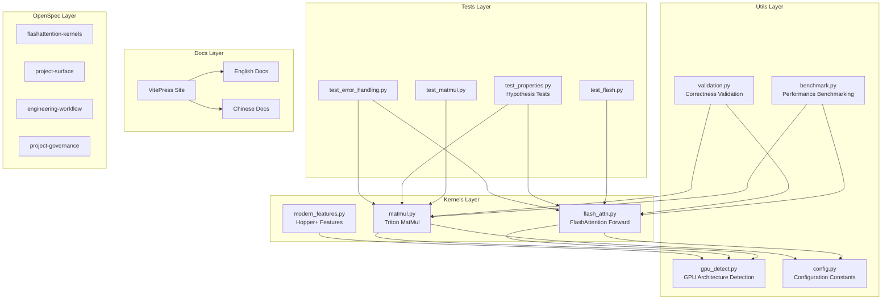

# CLAUDE.md

## Purpose

Use Claude in this repository as a **spec-driven cleanup and stabilization engineer**, not as a generic content generator.

## Default operating mode

1. Start from OpenSpec.
2. Read the active change artifacts before editing.
3. Keep edits tightly coupled to this repository's Triton kernels, docs site, CI, or GitHub metadata.
4. Prefer longer, coherent implementation runs over many tiny context resets.

## Command preferences

- `/opsx:explore` for ambiguity, architecture drift, or cross-cutting investigation
- `/opsx:propose` for new non-trivial work
- `/opsx:apply stabilize-project-for-archive` for the current cleanup program
- `/review` before merge or before declaring a large cleanup slice finished

## Cost and focus guidance

- Avoid high-cost broad-search modes unless the task genuinely spans many unrelated surfaces.
- Do not use expensive parallelism just because it is available; use it when it materially reduces uncertainty.
- Prefer finishing one task group fully before switching to another.

## Repository-specific expectations

- Preserve the educational, forward-only FlashAttention scope unless the active spec changes it.
- Keep GitHub Pages aligned with README and GitHub About metadata.
- Avoid generic engineering docs, generic changelog noise, or speculative framework sprawl.
- Explain LSP/MCP/tooling choices in terms of this repo's Python + VitePress + OpenSpec stack.

## Tool coordination

- **Copilot**: best for fast inline edits, lightweight follow-up changes, and GitHub-native flows.
- **Claude**: best for cross-file reasoning, workflow cleanup, spec/design refinement, and docs/architecture coherence.
- **Codex/opencode-style tools**: use for focused code execution once OpenSpec tasks are crisp.
- **MCP**: only add when it clearly replaces repetitive manual work; otherwise prefer built-ins plus `gh`.

---

## Project Overview

**diy-flash-attention** 是一个教育性的 FlashAttention 实现，使用 OpenAI Triton 构建。

### 核心定位
- **学习导向**：帮助开发者理解 FlashAttention 的内部机制
- **前向传播**：仅实现 forward pass，非生产训练框架
- **架构感知**：自动适配 Volta → Blackwell GPU 架构

### 技术栈
| 组件 | 技术 |
|------|------|
| GPU 内核 | Python + Triton 2.1+ |
| 包管理 | pyproject.toml (setuptools) |
| 文档站点 | VitePress 1.6+ (中英双语) |
| 规范管理 | OpenSpec |
| 质量工具 | ruff, mypy, pytest, hypothesis |
| CI/CD | GitHub Actions |

---

## Architecture



---

## Module Reference

### kernels/ - Triton GPU 内核

| 文件 | 职责 | 关键导出 |
|------|------|----------|
| `flash_attn.py` | FlashAttention 前向实现，在线 softmax，因果掩码 | `flash_attention()` |
| `matmul.py` | 高性能矩阵乘法，自动调优块大小 | `triton_matmul()` |
| `modern_features.py` | Hopper+ 特性检测 (TMA, FP8)，自适应内核选择 | `AdaptiveKernelSelector`, `supports_fp8()` |
| `__init__.py` | 包入口，统一导出 | 所有公开 API |

**支持的数据类型**: float16, float32, bfloat16
**支持的 head_dim**: 32, 64
**支持因果掩码**: 是

### utils/ - 工具函数

| 文件 | 职责 | 关键导出 |
|------|------|----------|
| `gpu_detect.py` | GPU 架构检测，最优配置推荐 | `detect_gpu()`, `GPUArch`, `GPUCapabilities` |
| `benchmark.py` | 性能基准测试，TFLOPS 计算 | `BenchmarkRunner`, `BenchmarkResult` |
| `validation.py` | 数值正确性验证 | `validate_matmul()`, `validate_attention()` |
| `config.py` | 配置常量集中管理 | `MATMUL_*`, `FLASH_ATTN_*`, `BENCHMARK_*` |

### tests/ - 测试套件

| 文件 | 类型 | 覆盖范围 |
|------|------|----------|
| `test_flash.py` | 单元测试 | FlashAttention 正确性 |
| `test_matmul.py` | 单元测试 | 矩阵乘法正确性 |
| `test_properties.py` | 属性测试 | Hypothesis 随机输入空间 |
| `test_error_handling.py` | 边界测试 | 异常处理路径 |
| `test_gpu_detect.py` | 功能测试 | GPU 检测逻辑 |
| `conftest.py` | Pytest 配置 | fixtures, markers |

**测试标记**: `@pytest.mark.cuda` (需要 GPU), `@pytest.mark.slow`

### benchmarks/ - 基准测试

| 文件 | 功能 |
|------|------|
| `bench_matmul.py` | 矩阵乘法性能对比 (Triton vs PyTorch) |
| `bench_flash.py` | FlashAttention 性能对比，内存伸缩测试 |

**CLI 入口**: `bench-matmul`, `bench-flash` (通过 pyproject.toml)

### docs/ - 文档站点

**结构**:
```
docs/
├── .vitepress/
│   ├── config.mts      # VitePress 配置
│   └── theme/          # 自定义主题组件
├── en/                 # 英文文档
│   ├── tutorial.md
│   ├── api.md
│   ├── performance.md
│   └── ...
├── zh/                 # 中文文档
│   ├── tutorial.md
│   └── ...
└── public/             # 静态资源
```

**部署**: GitHub Pages → https://lessup.github.io/diy-flash-attention/

### openspec/ - 规范管理

**活跃能力**:
| 能力 | 范围 |
|------|------|
| `flashattention-kernels` | 内核行为规范 |
| `project-surface` | README/Pages 一致性 |
| `engineering-workflow` | CI/质量工具 |
| `project-governance` | OpenSpec 工作流 |

**当前变更**: `stabilize-project-for-archive`

---

## Development Commands

```bash
# 安装
pip install -e ".[dev]"

# 测试
make test-cpu      # CPU-safe 测试路径
make test-gpu      # 完整 GPU 测试套件

# 质量检查
make lint          # ruff check
make format        # ruff format
make typecheck     # mypy

# 基准测试
make bench-all     # 运行所有基准
make demo          # 快速演示

# 文档
make docs          # 构建 VitePress 站点
npm run docs:dev   # 本地预览

# OpenSpec
openspec list --json
openspec validate --specs --json
```

---

## GPU Support Matrix

| 架构 | GPU | 计算能力 | 支持级别 |
|------|-----|----------|----------|
| Volta | V100 | SM70 | ✅ Basic |
| Turing | RTX 20xx | SM75 | ✅ Basic |
| Ampere | A100, RTX 30xx | SM80 | ✅ Full |
| Ada | RTX 40xx | SM89 | ✅ Full |
| Hopper | H100 | SM90 | ✅ TMA, FP8 |
| Blackwell | B100/B200 | SM100 | ✅ Latest |

---

## Key Dependencies

| 依赖 | 版本 | 用途 |
|------|------|------|
| torch | ≥2.0.0 | 张量操作，CUDA 支持 |
| triton | ≥2.1.0 | GPU 内核编写 |
| pytest | ≥7.0.0 | 测试框架 |
| hypothesis | ≥6.0.0 | 属性测试 |
| ruff | ≥0.1.0 | 代码格式化/检查 |
| mypy | ≥1.0.0 | 类型检查 |
| vitepress | ^1.6.3 | 文档站点 |

---

## Navigation Breadcrumbs

- **Root**: `/home/shane/dev/diy-flash-attention/`
- **Kernels**: → `kernels/CLAUDE.md`
- **Utils**: → `utils/CLAUDE.md`
- **Tests**: → `tests/CLAUDE.md`
- **Docs**: → `docs/CLAUDE.md`

---

## Initialized

- **Timestamp**: 2026-04-23T21:34:16+08:00
- **Coverage**: Full project scan completed
- **Files analyzed**: 50+ source files
- **Specs validated**: 4 capability specs
