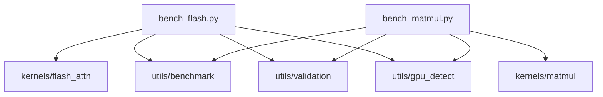

# benchmarks/ - 基准测试

> **导航**: [← 项目根目录](../CLAUDE.md)

## 模块概述

本目录包含 DIY FlashAttention 项目的性能基准测试工具，用于对比 Triton 内核与 PyTorch 参考实现的性能。

## 文件结构

```
benchmarks/
├── __init__.py        # 包入口
├── bench_matmul.py    # 矩阵乘法基准测试
└── bench_flash.py     # FlashAttention 基准测试
```

## CLI 入口

通过 `pyproject.toml` 配置的命令行入口：

```bash
bench-matmul          # 矩阵乘法基准测试
bench-flash           # FlashAttention 基准测试
```

## bench_matmul.py

### 功能

- 对比 Triton MatMul 与 `torch.matmul` 性能
- 测试不同矩阵尺寸
- 测试不同块大小配置
- 计算 TFLOPS 吞吐量

### 命令行参数

| 参数 | 类型 | 默认值 | 描述 |
|------|------|--------|------|
| `--sizes` | int... | 512 1024 2048 | 矩阵尺寸列表 |
| `--warmup` | int | 25 | 预热迭代次数 |
| `--rep` | int | 100 | 计时迭代次数 |
| `--test-block-sizes` | flag | False | 测试块大小变化 |

### 使用示例

```bash
# 基本运行
python benchmarks/bench_matmul.py

# 自定义尺寸
python benchmarks/bench_matmul.py --sizes 256 512 1024 2048 4096

# 测试块大小影响
python benchmarks/bench_matmul.py --test-block-sizes

# 通过 CLI 入口
bench-matmul --sizes 512 1024
```

### 输出示例

```
================================================================================
 Matrix Multiplication Benchmark
================================================================================
GPU: NVIDIA RTX 4090
Architecture: sm_89
Compute Capability: 8.9
...
------------------------------------------------------------
Size                 | Implementation          | Time (ms)    | TFLOPS
------------------------------------------------------------
512×512×512          | PyTorch                 | 0.12         | 89.34
512×512×512          | Triton                  | 0.11         | 97.52
                     | Speedup:                | 1.09x        |
------------------------------------------------------------
```

## bench_flash.py

### 功能

- 对比 FlashAttention 与 `torch.nn.functional.scaled_dot_product_attention`
- 测试不同序列长度
- 内存使用分析
- 内存伸缩测试 (O(N) vs O(N²))

### 命令行参数

| 参数 | 类型 | 默认值 | 描述 |
|------|------|--------|------|
| `--seq-lengths` | int... | 128 256 512 1024 2048 | 序列长度列表 |
| `--batch-size` | int | 4 | 批大小 |
| `--num-heads` | int | 8 | 注意力头数 |
| `--head-dim` | int | 64 | 头维度 |
| `--causal` | flag | False | 启用因果掩码 |
| `--warmup` | int | 25 | 预热迭代次数 |
| `--rep` | int | 100 | 计时迭代次数 |
| `--validate` | flag | True | 运行前验证正确性 |
| `--memory-test` | flag | True | 运行内存伸缩测试 |

### 使用示例

```bash
# 基本运行
python benchmarks/bench_flash.py

# 因果注意力
python benchmarks/bench_flash.py --causal

# 自定义序列长度
python benchmarks/bench_flash.py --seq-lengths 128 256 512 1024 2048 4096

# 通过 CLI 入口
bench-flash --causal --batch-size 8
```

### 内存伸缩测试

自动分析内存增长模式：

```
Memory Scaling Test
------------------------------------------------------------
Seq Len    | PyTorch (MB)     | Flash (MB)     | Ratio
------------------------------------------------------------
128        | 0.5              | 0.1            | 5.0x
256        | 2.0              | 0.2            | 10.0x
512        | 8.0              | 0.4            | 20.0x
1024       | 32.0             | 0.8            | 40.0x
------------------------------------------------------------

Scaling Analysis (seq_len: 128 → 1024, ratio: 8x):
  PyTorch memory grew: 64.0x (O(N²) would be 64.0x)
  Flash memory grew:   8.0x (O(N) would be 8.0x)
  ✓ FlashAttention shows approximately O(N) memory scaling!
```

## 依赖关系



## 性能指标

### TFLOPS 计算

```python
# MatMul FLOPs
flops = 2 * M * N * K

# Attention FLOPs (approximate)
flops = 2 * batch * heads * seq_len * seq_len * head_dim  # QK
      + 2 * batch * heads * seq_len * head_dim * seq_len  # AV
```

### 时间测量

使用 `triton.testing.do_bench`:
- 多次预热迭代
- 多次计时迭代
- 返回中位数和分位数

## Makefile 目标

```bash
make bench-matmul       # MatMul 基准测试
make bench-flash        # FlashAttention 基准测试
make bench-all          # 所有基准测试
make bench-report       # 生成报告
```

---

**初始化时间**: 2026-04-23T21:34:16+08:00
