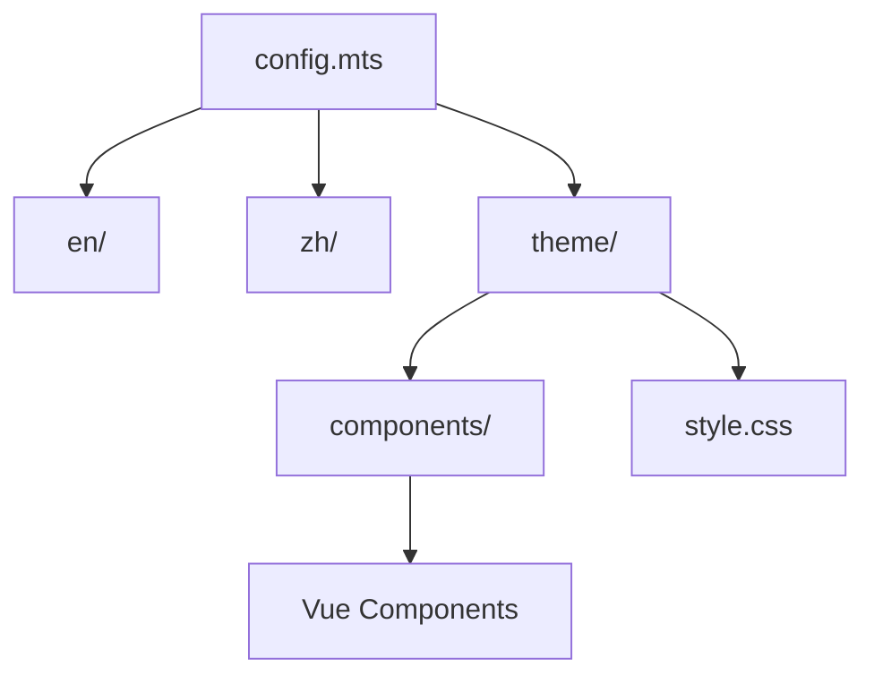

# docs/ - 文档站点

## 模块概述

本目录包含 DIY FlashAttention 的 VitePress 文档站点，支持中英双语。

## 文件结构

```
docs/
├── .vitepress/
│   ├── config.mts           # VitePress 主配置
│   ├── theme/
│   │   ├── index.ts         # 主题入口
│   │   ├── components/      # Vue 组件
│   │   │   ├── FlashAttentionVisualizer.vue
│   │   │   ├── GpuArchitectureVisualizer.vue
│   │   │   └── BenchmarkChart.vue
│   │   └── style.css        # 自定义样式
│   └── dist/                # 构建输出
├── public/
│   ├── logo.svg             # 站点 Logo
│   ├── og-image.svg         # Open Graph 图片
│   ├── manifest.json        # PWA 清单
│   └── sw.js                # Service Worker
├── en/                      # 英文文档
│   ├── index.md             # 首页
│   ├── tutorial.md          # 教程
│   ├── api.md               # API 参考
│   ├── performance.md       # 性能指南
│   ├── cheatsheet.md        # 速查表
│   ├── faq.md               # 常见问题
│   └── changelog.md         # 更新日志
├── zh/                      # 中文文档
│   ├── index.md             # 首页
│   ├── tutorial.md          # 教程
│   ├── api.md               # API 参考
│   ├── performance.md       # 性能指南
│   ├── cheatsheet.md        # 速查表
│   ├── faq.md               # 常见问题
│   └── changelog.md         # 更新日志
└── index.md                 # 根首页 (重定向)
```

## VitePress 配置

### 核心设置

```typescript
// config.mts
{
  title: 'DIY FlashAttention',
  description: 'Learn Triton by implementing FlashAttention from scratch.',
  base: '/diy-flash-attention/',
  appearance: 'dark',  // 默认深色模式
}
```

### 语言支持

| 语言 | 路径前缀 |
|------|----------|
| English | `/en/` |
| 中文 | `/zh/` |

### 导航结构

**English**:
- Home → Tutorial → API → Resources (Performance, Cheatsheet, FAQ)

**中文**:
- 首页 → 教程 → API → 资源 (性能指南, 速查表, 常见问题)

## 页面说明

### en/tutorial.md & zh/tutorial.md

循序渐进的 FlashAttention 学习教程：
1. GPU 基础概念
2. Triton 入门
3. 矩阵乘法内核
4. FlashAttention 算法
5. 性能优化技巧

### en/api.md & zh/api.md

完整的 API 参考文档：
- `flash_attention()` 参数与返回值
- `triton_matmul()` 参数与返回值
- GPU 检测 API
- 配置常量

### en/performance.md & zh/performance.md

性能优化指南：
- 块大小选择策略
- 内存分析
- GPU 架构适配
- 基准测试解读

### en/cheatsheet.md & zh/cheatsheet.md

快速参考：
- 常用代码片段
- 配置模板
- 故障排除

### en/faq.md & zh/faq.md

常见问题解答：
- 安装问题
- 兼容性问题
- 性能问题

## 自定义组件

### FlashAttentionVisualizer.vue

FlashAttention 算法可视化：
- 分块计算过程动画
- 内存访问模式展示

### GpuArchitectureVisualizer.vue

GPU 架构对比图表：
- 架构特性对比
- 计算能力映射

### BenchmarkChart.vue

基准测试结果图表：
- 性能对比柱状图
- 内存使用对比

## 构建与部署

### 本地开发

```bash
npm run docs:dev     # 启动开发服务器
```

### 构建

```bash
npm run docs:build   # 构建静态站点
```

### 部署

通过 GitHub Actions 自动部署到 GitHub Pages：
- 触发: push 到 master/main
- 配置: `.github/workflows/pages.yml`
- URL: https://lessup.github.io/diy-flash-attention/

## SEO 配置

### Open Graph

```typescript
['meta', { property: 'og:title', content: '...' }],
['meta', { property: 'og:description', content: '...' }],
['meta', { property: 'og:image', content: '...' }],
```

### Twitter Card

```typescript
['meta', { name: 'twitter:card', content: 'summary_large_image' }],
```

### JSON-LD

```typescript
['script', { type: 'application/ld+json' }, JSON.stringify({
  '@context': 'https://schema.org',
  '@type': 'TechArticle',
  ...
})]
```

## 依赖关系



## 与 README 同步

根据 `openspec/specs/project-surface/spec.md`:
- README 和 GitHub Pages 应讲述同一个故事
- 文档定位为教育性、动手实践的学习资源
- 明确区分已实现功能与未来方向

---

**初始化时间**: 2026-04-23T21:34:16+08:00
