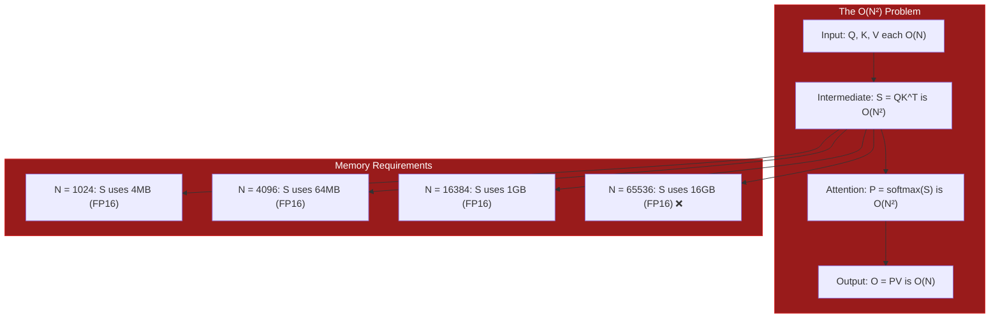
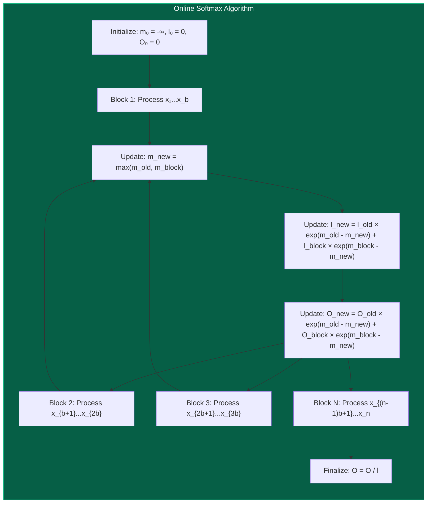
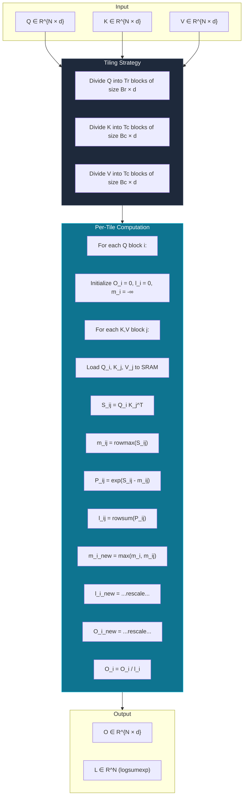
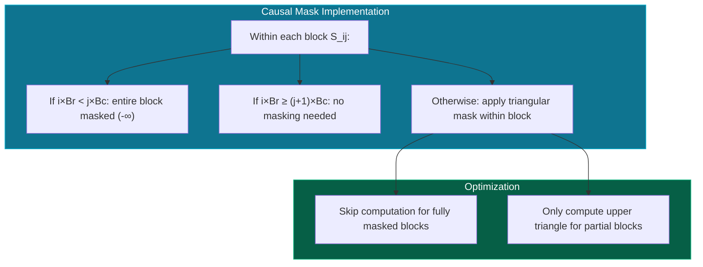

# Algorithm Deep Dive

This document provides a comprehensive mathematical analysis of the FlashAttention algorithm, including the derivation of online softmax, tiling strategies, and complexity analysis.

## The Attention Problem

### Standard Attention Computation

Given query, key, and value matrices $Q, K, V \in \mathbb{R}^{N \times d}$, the attention output is:

$$
\text{Attention}(Q, K, V) = \text{softmax}\left(\frac{QK^T}{\sqrt{d_k}}\right) V
$$

Breaking this down:

1. **Score Matrix**: $S = QK^T \in \mathbb{R}^{N \times N}$
2. **Scaled Scores**: $\tilde{S} = S / \sqrt{d_k}$
3. **Attention Weights**: $P = \text{softmax}(\tilde{S}) \in \mathbb{R}^{N \times N}$
4. **Output**: $O = PV \in \mathbb{R}^{N \times d}$

### The Memory Problem



The key insight: **We never need to store the full N×N attention matrix**. FlashAttention computes the same result while only using O(N) memory.

---

## Online Softmax: The Key Innovation

### Standard Softmax

For a vector $x = [x_1, x_2, \ldots, x_n]$:

$$
\text{softmax}(x_i) = \frac{e^{x_i}}{\sum_{j=1}^{n} e^{x_j}} = \frac{e^{x_i}}{Z}
$$

where $Z = \sum_{j=1}^{n} e^{x_j}$ is the partition function.

### The Challenge

Standard softmax requires knowing all values before computing any output. How do we compute softmax incrementally across blocks?

### Online Softmax Algorithm

The key insight: **Track the running maximum and sum** to enable incremental computation.



### Mathematical Derivation

**Step 1**: For block $j$, compute local statistics:
- $m_j = \max_{i \in \text{block}_j} x_i$ (local maximum)
- $l_j = \sum_{i \in \text{block}_j} e^{x_i - m_j}$ (local sum)

**Step 2**: Combine with previous statistics:
- $m_{\text{new}} = \max(m_{\text{old}}, m_j)$
- $l_{\text{new}} = l_{\text{old}} \cdot e^{m_{\text{old}} - m_{\text{new}}} + l_j \cdot e^{m_j - m_{\text{new}}}$

**Step 3**: Update output incrementally:
- $O_{\text{new}} = O_{\text{old}} \cdot e^{m_{\text{old}} - m_{\text{new}}} + O_j \cdot e^{m_j - m_{\text{new}}}$

**Final**: Normalize by total sum:
- $O_{\text{final}} = O_{\text{new}} / l_{\text{new}}$

### Correctness Proof

**Claim**: The online algorithm produces the same result as standard softmax.

**Proof**:
For the standard softmax on full vector $x$:

$$
\text{softmax}(x_i) = \frac{e^{x_i}}{\sum_j e^{x_j}} = \frac{e^{x_i - m}}{\sum_j e^{x_j - m}}
$$

where $m = \max_j x_j$ (numerical stability trick).

After processing all blocks:
$$
l_{\text{final}} = \sum_{\text{blocks } j} l_j \cdot e^{m_j - m_{\text{final}}}
$$

This equals:
$$
\sum_j \sum_{i \in \text{block}_j} e^{x_i - m_j} \cdot e^{m_j - m_{\text{final}}} = \sum_i e^{x_i - m_{\text{final}}}
$$

Since $m_{\text{final}} = \max_i x_i$, we have:
$$
l_{\text{final}} = \sum_i e^{x_i - m} = Z \cdot e^{-m}
$$

Therefore:
$$
O_{\text{final}} = O_{\text{new}} / l_{\text{new}} = \frac{\sum_i v_i \cdot e^{x_i - m}}{\sum_i e^{x_i - m}} = \text{softmax}(x)^T V
$$

∎

---

## Tiled FlashAttention Algorithm

### Notation

- $N$: Sequence length
- $d$: Head dimension  
- $B_r, B_c$: Row and column block sizes
- $T_r = \lceil N / B_r \rceil$: Number of row blocks
- $T_c = \lceil N / B_c \rceil$: Number of column blocks

### Algorithm Overview



### Pseudocode

```
function FlashAttention(Q, K, V, Br, Bc):
    N, d = Q.shape
    Tr = ceil(N / Br)
    Tc = ceil(N / Bc)
    
    O = zeros(N, d)
    L = zeros(N)
    
    for i in range(Tr):
        # Initialize for this row block
        O_i = zeros(Br, d)
        l_i = zeros(Br)
        m_i = -inf * ones(Br)
        
        for j in range(Tc):
            # Load blocks to SRAM
            Q_i = Q[i*Br:(i+1)*Br, :]      # [Br, d]
            K_j = K[j*Bc:(j+1)*Bc, :]      # [Bc, d]
            V_j = V[j*Bc:(j+1)*Bc, :]      # [Bc, d]
            
            # Compute attention scores
            S_ij = Q_i @ K_j.T / sqrt(d)   # [Br, Bc]
            
            # Online softmax
            m_ij = max(S_ij, dim=1)        # [Br]
            P_ij = exp(S_ij - m_ij[:, None])  # [Br, Bc]
            l_ij = sum(P_ij, dim=1)        # [Br]
            
            # Update statistics
            m_new = max(m_i, m_ij)
            alpha = exp(m_i - m_new)
            beta = exp(m_ij - m_new)
            
            l_new = alpha * l_i + beta * l_ij
            O_i = alpha[:, None] * O_i + beta[:, None] * (P_ij @ V_j)
            
            m_i = m_new
            l_i = l_new
        
        # Finalize output
        O[i*Br:(i+1)*Br, :] = O_i / l_i[:, None]
        L[i*Br:(i+1)*Br] = m_i + log(l_i)
    
    return O, L
```

### Memory Access Analysis

| Operation | Standard Attention | FlashAttention |
|-----------|-------------------|----------------|
| Read Q | O(N) once | O(N) Tc times (streamed) |
| Read K | O(N) once | O(N) Tr times (cached in SRAM) |
| Read V | O(N) once | O(N) Tr times (cached in SRAM) |
| Write S | O(N²) | **Never** (SRAM only) |
| Read S | O(N²) | **Never** (SRAM only) |
| Write P | O(N²) | **Never** (SRAM only) |
| Read P | O(N²) | **Never** (SRAM only) |
| Write O | O(N) once | O(N) once |
| **Total HBM** | **O(N²)** | **O(N)** |

---

## Causal Masking

For autoregressive models (GPT-style), we need to mask future positions:

$$
\text{Attention}(Q, K, V) = \text{softmax}\left(\frac{QK^T + M}{\sqrt{d_k}}\right) V
$$

where $M_{ij} = -\infty$ if $i < j$ (causal mask).

### Implementation



### Masking Pseudocode

```
function apply_causal_mask(S_ij, i, j, Br, Bc):
    start_row = i * Br
    start_col = j * Bc
    
    if start_row < start_col:
        # Entire block is in the future
        return -inf * ones_like(S_ij)
    elif start_row >= start_col + Bc:
        # Entire block is in the past
        return S_ij  # No masking needed
    else:
        # Partial overlap: apply triangular mask
        for r in range(Br):
            for c in range(Bc):
                if start_row + r < start_col + c:
                    S_ij[r, c] = -inf
        return S_ij
```

---

## Complexity Analysis

### Time Complexity

| Operation | Standard | FlashAttention |
|-----------|----------|----------------|
| QK^T | O(N² d) | O(N² d) |
| Softmax | O(N²) | O(N²) |
| PV | O(N² d) | O(N² d) |
| **Total** | **O(N² d)** | **O(N² d)** |

FlashAttention has the same time complexity but **fewer memory accesses**.

### Memory Complexity

| Method | Memory | HBM Accesses |
|--------|--------|--------------|
| Standard | O(N²) | O(N²) |
| FlashAttention | O(N) | O(N) |

### Arithmetic Intensity

Arithmetic intensity = FLOPs / Bytes accessed

```
Standard Attention:
- FLOPs: 2N²d + 2Nd² + 5N² ≈ 2N²d (for large N)
- Bytes: 2Nd + 2N² + 2N² + Nd = 5N² + 3Nd
- Intensity: ~2d/5 FLOPs/byte

FlashAttention:
- FLOPs: Same as standard
- Bytes: ~12Nd (Q, K, V loaded multiple times, O written once)
- Intensity: ~Nd/6 FLOPs/byte
```

For d=64, N=4096:
- Standard: ~25.6 FLOPs/byte
- FlashAttention: ~682.7 FLOPs/byte (**26x higher!**)

---

## Numerical Stability

### The Log-Sum-Exp Trick

Direct computation of $\sum e^{x_i}$ can overflow. Instead:

$$
\log \sum_i e^{x_i} = m + \log \sum_i e^{x_i - m}
$$

where $m = \max_i x_i$.

### FlashAttention's Approach

The algorithm naturally maintains numerical stability by:

1. **Tracking local maximums**: Each block's max prevents overflow
2. **Incremental rescaling**: Rescales previous results when finding a new max
3. **Log-sum-exp output**: Returns $L_i = m_i + \log l_i$ for backward pass

---

## V1 vs V2 Comparison

| Aspect | V1 (Column-Parallel) | V2 (Row-Parallel) |
|--------|---------------------|-------------------|
| **Parallelization** | Over Q blocks | Better work distribution |
| **Memory Pattern** | K, V loaded once per block | Optimized HBM access |
| **Non-Matmul FLOPs** | Higher | Reduced |
| **Work Partitioning** | Simple | Optimized |
| **Performance** | Baseline | +5-15% on Ampere+ |
| **Best For** | Older GPUs, shorter sequences | Modern GPUs, long sequences |

---

## See Also

- [Architecture Design](/en/architecture) - System architecture and memory hierarchy
- [Performance Guide](/en/performance) - Tuning block sizes and optimization
- [API Reference](/en/api) - Function signatures and usage examples
