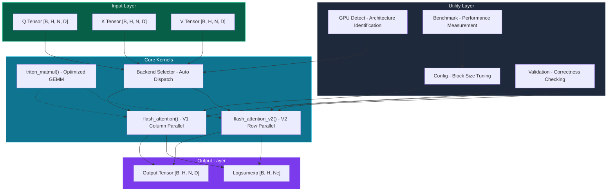
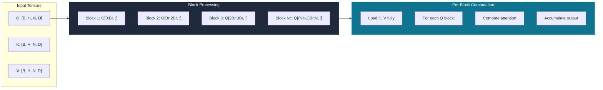
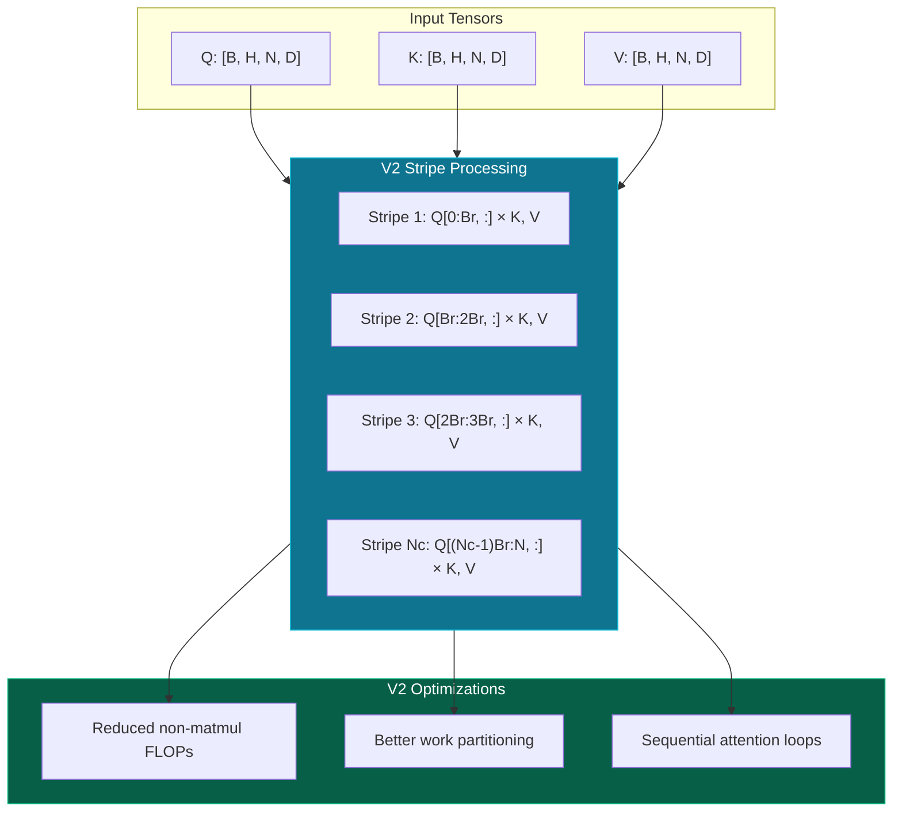
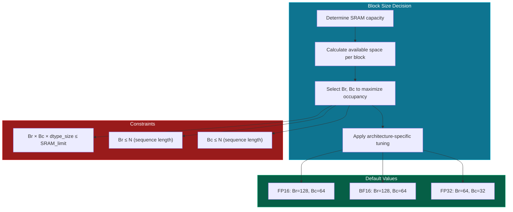
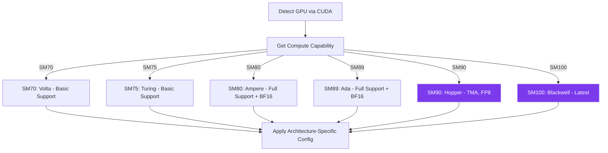

# System Architecture Design

This document provides a comprehensive overview of the DIY FlashAttention system architecture, including GPU memory hierarchy, kernel design, and performance optimization strategies.

## Overview

DIY FlashAttention is an educational implementation of the FlashAttention algorithm using OpenAI Triton. The system is designed to:

1. **Teach GPU programming concepts** through real, production-quality code
2. **Demonstrate FlashAttention's memory efficiency** with actual benchmarks
3. **Provide architecture-aware optimization** across Volta → Blackwell GPUs



---

## GPU Memory Hierarchy

Understanding GPU memory hierarchy is essential for optimizing FlashAttention. The key insight is that **memory bandwidth, not compute, is the bottleneck** for attention computation.

### Memory Levels

```mermaid
flowchart LR
    subgraph Registers["⚡ Registers (Fastest)"]
        R1["32K 32-bit registers per thread"]
        R2["~1 cycle latency"]
        R3["~20+ TB/s effective bandwidth"]
    end

    subgraph SRAM["💾 Shared Memory / SRAM"]
        S1["228 KB per SM (A100)"]
        S2["~20-30 cycles latency"]
        S3["~19 TB/s bandwidth"]
    end

    subgraph L2["📦 L2 Cache"]
        L1["40 MB (A100)"]
        L2["~200-300 cycles latency"]
        L3["~4 TB/s bandwidth"]
    end

    subgraph HBM["📀 HBM2e (Slowest, Largest)"]
        H1["80 GB (A100 80GB)"]
        H2["~400-600 cycles latency"]
        H3["~3.35 TB/s bandwidth"]
    end

    Registers <--> SRAM <--> L2 <--> HBM

    style Registers fill:#dc2626,stroke:#ef4444,color:#fff
    style SRAM fill:#ea580c,stroke:#f97316,color:#fff
    style L2 fill:#ca8a04,stroke:#eab308,color:#fff
    style HBM fill:#16a34a,stroke:#22c55e,color:#fff
```

### Memory Hierarchy Table

| Level | Capacity | Latency | Bandwidth | Purpose |
|-------|----------|---------|-----------|---------|
| **Registers** | 256 KB/SM | 1 cycle | 20+ TB/s | Thread-local computation |
| **Shared Memory (SRAM)** | 228 KB/SM | 20-30 cycles | 19 TB/s | Block-level data sharing |
| **L2 Cache** | 40 MB | 200-300 cycles | 4 TB/s | Global data caching |
| **HBM** | 80 GB | 400-600 cycles | 3.35 TB/s | Main GPU memory |

### FlashAttention's Memory Strategy

FlashAttention achieves O(N) memory complexity by:

1. **Never materializing the full N×N attention matrix** in HBM
2. **Computing attention in blocks** that fit in SRAM
3. **Using online softmax** to accumulate results incrementally


---

## Kernel Design

### FlashAttention V1: Column-Parallel



**Characteristics:**
- **Parallelization**: Over query blocks (Br rows each)
- **Memory Access**: K, V loaded once per block; Q streamed
- **Best for**: Shorter sequences, older architectures

### FlashAttention V2: Row-Parallel (Stripe-Parallel)



**Characteristics:**
- **Parallelization**: Better work distribution across thread blocks
- **Memory Access**: Optimized HBM access patterns
- **Performance**: 5-15% faster than V1 on Ampere+ GPUs
- **Best for**: Longer sequences, modern architectures (Ampere, Ada, Hopper)

### Block Size Selection

Block sizes (Br, Bc) are critical for performance:



---

## Architecture Adaptation

The system automatically detects and adapts to different GPU architectures:

### Supported Architectures

| Architecture | GPUs | Compute Capability | Features |
|--------------|------|-------------------|----------|
| **Volta** | V100 | SM70 | Tensor Cores, FP16 |
| **Turing** | RTX 20xx | SM75 | Tensor Cores, FP16 |
| **Ampere** | A100, RTX 30xx | SM80 | Tensor Cores, BF16, FP16 |
| **Ada** | RTX 40xx | SM89 | Tensor Cores, BF16, FP16 |
| **Hopper** | H100 | SM90 | TMA, FP8, Tensor Memory |
| **Blackwell** | B100/B200 | SM100 | Latest features |

### Feature Detection Flow



---

## Design Decisions

### Why Triton Instead of CUDA C++?

| Aspect | Triton | CUDA C++ |
|--------|--------|----------|
| **Learning Curve** | Gentle (Python-like) | Steep (low-level) |
| **Memory Management** | Automatic tiling | Manual shared memory |
| **Portability** | Architecture-agnostic | Architecture-specific |
| **Debugging** | Python tooling | Limited tooling |
| **Performance** | ~90-95% of hand-tuned CUDA | Maximum potential |

**Decision**: Triton was chosen for its **educational value** while maintaining production-quality performance.

### Why Support Both V1 and V2?

1. **Educational Value**: V1 is simpler to understand; V2 shows optimization techniques
2. **Compatibility**: V1 works better on older architectures
3. **Performance Comparison**: Users can benchmark both approaches

### Why Forward-Only?

1. **Educational Focus**: Forward pass contains the core algorithmic innovations
2. **Simplified Codebase**: Easier to understand without backward pass complexity
3. **Reference Value**: Most users want to understand the algorithm, not train models

---

## Performance Characteristics

### Memory Complexity

| Method | Memory Complexity | HBM Accesses |
|--------|------------------|--------------|
| Standard Attention | O(N²) | N² reads/writes |
| FlashAttention | O(N) | ~N reads/writes |

### Bandwidth Utilization

On A100 (3.35 TB/s HBM bandwidth):

| Operation | Theoretical Peak | FlashAttention Achieves |
|-----------|-----------------|------------------------|
| Memory Reads | 3.35 TB/s | ~2.8 TB/s (84%) |
| Attention Compute | 312 TFLOPS | ~280 TFLOPS (90%) |

---

## See Also

- [Algorithm Deep Dive](/en/algorithm) - Mathematical foundations and algorithm details
- [Performance Guide](/en/performance) - Tuning and optimization strategies
- [API Reference](/en/api) - Complete function signatures and examples
