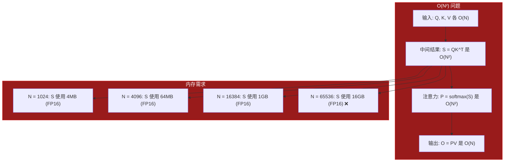
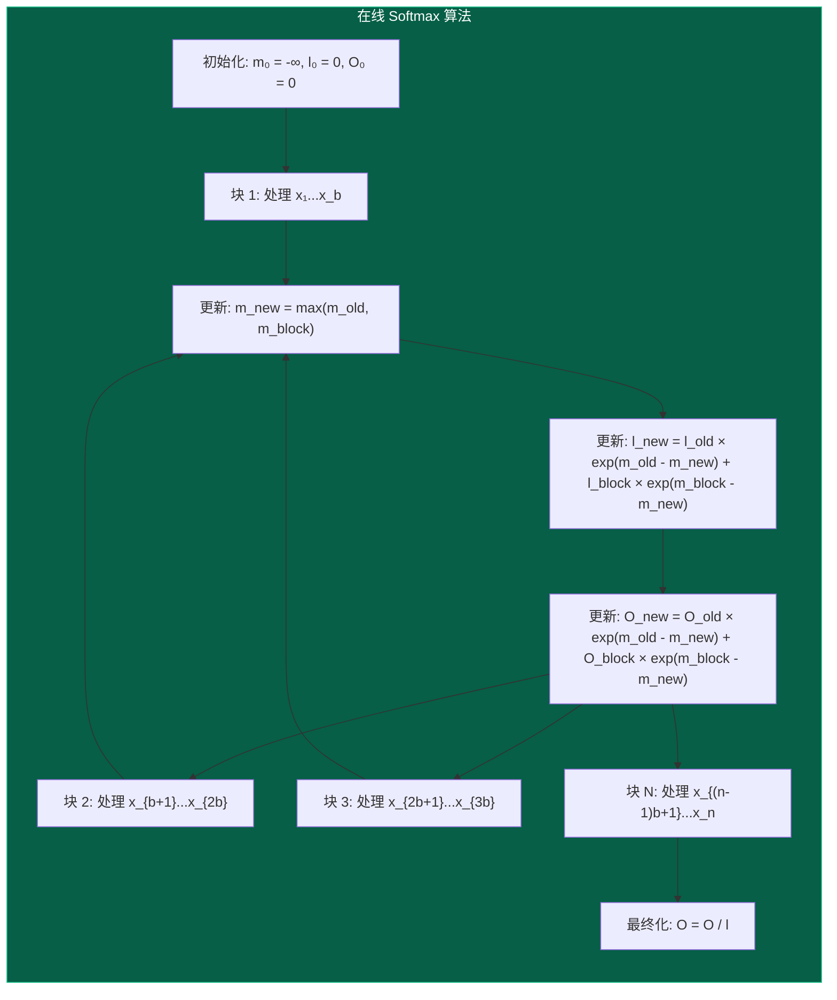
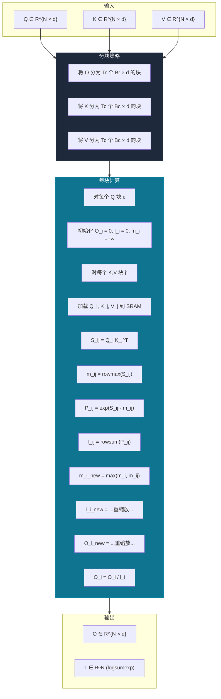
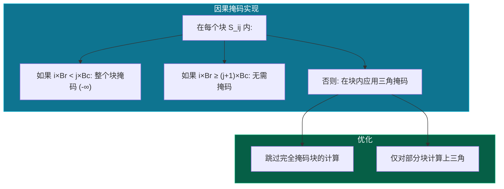

# 算法详解

本文档提供 FlashAttention 算法的全面数学分析，包括在线 softmax 推导、分块策略和复杂度分析。

## 注意力问题

### 标准注意力计算

给定查询、键、值矩阵 $Q, K, V \in \mathbb{R}^{N \times d}$，注意力输出为：

$$
\text{Attention}(Q, K, V) = \text{softmax}\left(\frac{QK^T}{\sqrt{d_k}}\right) V
$$

分解步骤：

1. **分数矩阵**：$S = QK^T \in \mathbb{R}^{N \times N}$
2. **缩放分数**：$\tilde{S} = S / \sqrt{d_k}$
3. **注意力权重**：$P = \text{softmax}(\tilde{S}) \in \mathbb{R}^{N \times N}$
4. **输出**：$O = PV \in \mathbb{R}^{N \times d}$

### 内存问题



核心洞察：**我们永远不需要存储完整的 N×N 注意力矩阵**。FlashAttention 计算相同结果，但仅使用 O(N) 内存。

---

## 在线 Softmax：关键创新

### 标准 Softmax

对于向量 $x = [x_1, x_2, \ldots, x_n]$：

$$
\text{softmax}(x_i) = \frac{e^{x_i}}{\sum_{j=1}^{n} e^{x_j}} = \frac{e^{x_i}}{Z}
$$

其中 $Z = \sum_{j=1}^{n} e^{x_j}$ 是配分函数。

### 挑战

标准 softmax 需要在计算任何输出之前知道所有值。如何跨块增量计算 softmax？

### 在线 Softmax 算法

核心洞察：**跟踪运行最大值和总和**以实现增量计算。



### 数学推导

**步骤 1**：对于块 $j$，计算局部统计量：
- $m_j = \max_{i \in \text{block}_j} x_i$（局部最大值）
- $l_j = \sum_{i \in \text{block}_j} e^{x_i - m_j}$（局部和）

**步骤 2**：与之前的统计量合并：
- $m_{\text{new}} = \max(m_{\text{old}}, m_j)$
- $l_{\text{new}} = l_{\text{old}} \cdot e^{m_{\text{old}} - m_{\text{new}}} + l_j \cdot e^{m_j - m_{\text{new}}}$

**步骤 3**：增量更新输出：
- $O_{\text{new}} = O_{\text{old}} \cdot e^{m_{\text{old}} - m_{\text{new}}} + O_j \cdot e^{m_j - m_{\text{new}}}$

**最终**：按总和归一化：
- $O_{\text{final}} = O_{\text{new}} / l_{\text{new}}$

### 正确性证明

**声明**：在线算法产生与标准 softmax 相同的结果。

**证明**：
对于完整向量 $x$ 的标准 softmax：

$$
\text{softmax}(x_i) = \frac{e^{x_i}}{\sum_j e^{x_j}} = \frac{e^{x_i - m}}{\sum_j e^{x_j - m}}
$$

其中 $m = \max_j x_j$（数值稳定性技巧）。

处理所有块后：
$$
l_{\text{final}} = \sum_{\text{blocks } j} l_j \cdot e^{m_j - m_{\text{final}}}
$$

这等于：
$$
\sum_j \sum_{i \in \text{block}_j} e^{x_i - m_j} \cdot e^{m_j - m_{\text{final}}} = \sum_i e^{x_i - m_{\text{final}}}
$$

由于 $m_{\text{final}} = \max_i x_i$，我们有：
$$
l_{\text{final}} = \sum_i e^{x_i - m} = Z \cdot e^{-m}
$$

因此：
$$
O_{\text{final}} = O_{\text{new}} / l_{\text{new}} = \frac{\sum_i v_i \cdot e^{x_i - m}}{\sum_i e^{x_i - m}} = \text{softmax}(x)^T V
$$

∎

---

## 分块 FlashAttention 算法

### 符号

- $N$：序列长度
- $d$：头维度
- $B_r, B_c$：行和列块大小
- $T_r = \lceil N / B_r \rceil$：行块数量
- $T_c = \lceil N / B_c \rceil$：列块数量

### 算法概览



### 伪代码

```
function FlashAttention(Q, K, V, Br, Bc):
    N, d = Q.shape
    Tr = ceil(N / Br)
    Tc = ceil(N / Bc)
    
    O = zeros(N, d)
    L = zeros(N)
    
    for i in range(Tr):
        # 为此行块初始化
        O_i = zeros(Br, d)
        l_i = zeros(Br)
        m_i = -inf * ones(Br)
        
        for j in range(Tc):
            # 加载块到 SRAM
            Q_i = Q[i*Br:(i+1)*Br, :]      # [Br, d]
            K_j = K[j*Bc:(j+1)*Bc, :]      # [Bc, d]
            V_j = V[j*Bc:(j+1)*Bc, :]      # [Bc, d]
            
            # 计算注意力分数
            S_ij = Q_i @ K_j.T / sqrt(d)   # [Br, Bc]
            
            # 在线 softmax
            m_ij = max(S_ij, dim=1)        # [Br]
            P_ij = exp(S_ij - m_ij[:, None])  # [Br, Bc]
            l_ij = sum(P_ij, dim=1)        # [Br]
            
            # 更新统计量
            m_new = max(m_i, m_ij)
            alpha = exp(m_i - m_new)
            beta = exp(m_ij - m_new)
            
            l_new = alpha * l_i + beta * l_ij
            O_i = alpha[:, None] * O_i + beta[:, None] * (P_ij @ V_j)
            
            m_i = m_new
            l_i = l_new
        
        # 最终化输出
        O[i*Br:(i+1)*Br, :] = O_i / l_i[:, None]
        L[i*Br:(i+1)*Br] = m_i + log(l_i)
    
    return O, L
```

### 内存访问分析

| 操作 | 标准注意力 | FlashAttention |
|------|-----------|----------------|
| 读取 Q | O(N) 一次 | O(N) Tc 次（流式） |
| 读取 K | O(N) 一次 | O(N) Tr 次（缓存在 SRAM） |
| 读取 V | O(N) 一次 | O(N) Tr 次（缓存在 SRAM） |
| 写入 S | O(N²) | **从不**（仅 SRAM） |
| 读取 S | O(N²) | **从不**（仅 SRAM） |
| 写入 P | O(N²) | **从不**（仅 SRAM） |
| 读取 P | O(N²) | **从不**（仅 SRAM） |
| 写入 O | O(N) 一次 | O(N) 一次 |
| **总 HBM** | **O(N²)** | **O(N)** |

---

## 因果掩码

对于自回归模型（GPT 风格），我们需要掩码未来位置：

$$
\text{Attention}(Q, K, V) = \text{softmax}\left(\frac{QK^T + M}{\sqrt{d_k}}\right) V
$$

其中 $M_{ij} = -\infty$ 如果 $i < j$（因果掩码）。

### 实现



### 掩码伪代码

```
function apply_causal_mask(S_ij, i, j, Br, Bc):
    start_row = i * Br
    start_col = j * Bc
    
    if start_row < start_col:
        # 整个块在未来
        return -inf * ones_like(S_ij)
    elif start_row >= start_col + Bc:
        # 整个块在过去
        return S_ij  # 无需掩码
    else:
        # 部分重叠: 应用三角掩码
        for r in range(Br):
            for c in range(Bc):
                if start_row + r < start_col + c:
                    S_ij[r, c] = -inf
        return S_ij
```

---

## 复杂度分析

### 时间复杂度

| 操作 | 标准 | FlashAttention |
|------|------|----------------|
| QK^T | O(N² d) | O(N² d) |
| Softmax | O(N²) | O(N²) |
| PV | O(N² d) | O(N² d) |
| **总计** | **O(N² d)** | **O(N² d)** |

FlashAttention 具有相同的时间复杂度，但**更少的内存访问**。

### 内存复杂度

| 方法 | 内存 | HBM 访问 |
|------|------|----------|
| 标准 | O(N²) | O(N²) |
| FlashAttention | O(N) | O(N) |

### 算术强度

算术强度 = FLOPs / 访问字节数

```
标准注意力:
- FLOPs: 2N²d + 2Nd² + 5N² ≈ 2N²d (大 N 时)
- Bytes: 2Nd + 2N² + 2N² + Nd = 5N² + 3Nd
- 强度: ~2d/5 FLOPs/byte

FlashAttention:
- FLOPs: 与标准相同
- Bytes: ~12Nd (Q, K, V 多次加载, O 写入一次)
- 强度: ~Nd/6 FLOPs/byte
```

对于 d=64, N=4096：
- 标准：~25.6 FLOPs/byte
- FlashAttention：~682.7 FLOPs/byte（**高 26 倍！**）

---

## 数值稳定性

### Log-Sum-Exp 技巧

直接计算 $\sum e^{x_i}$ 可能溢出。替代方案：

$$
\log \sum_i e^{x_i} = m + \log \sum_i e^{x_i - m}
$$

其中 $m = \max_i x_i$。

### FlashAttention 的方法

算法自然保持数值稳定性：

1. **跟踪局部最大值**：每块的最大值防止溢出
2. **增量重缩放**：发现新最大值时重缩放之前的结果
3. **Log-sum-exp 输出**：返回 $L_i = m_i + \log l_i$ 用于反向传播

---

## V1 vs V2 对比

| 方面 | V1（列并行） | V2（行并行） |
|------|-------------|-------------|
| **并行化** | 在 Q 块上 | 更好的工作分布 |
| **内存模式** | K, V 每块加载一次 | 优化的 HBM 访问 |
| **非 Matmul FLOPs** | 较高 | 减少 |
| **工作划分** | 简单 | 优化 |
| **性能** | 基线 | Ampere+ 上 +5-15% |
| **最适合** | 较老 GPU、较短序列 | 现代 GPU、长序列 |

---

## 另见

- [架构设计](/zh/architecture) - 系统架构和内存层次
- [性能指南](/zh/performance) - 块大小调优和优化
- [API 参考](/zh/api) - 函数签名和使用示例
