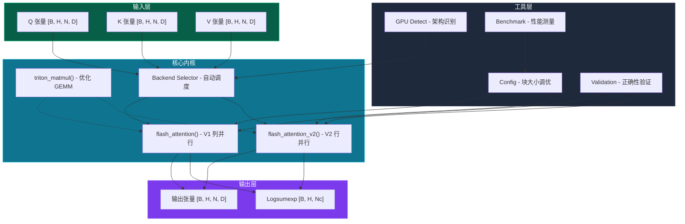
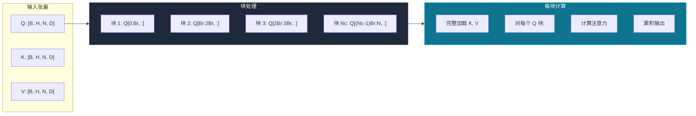
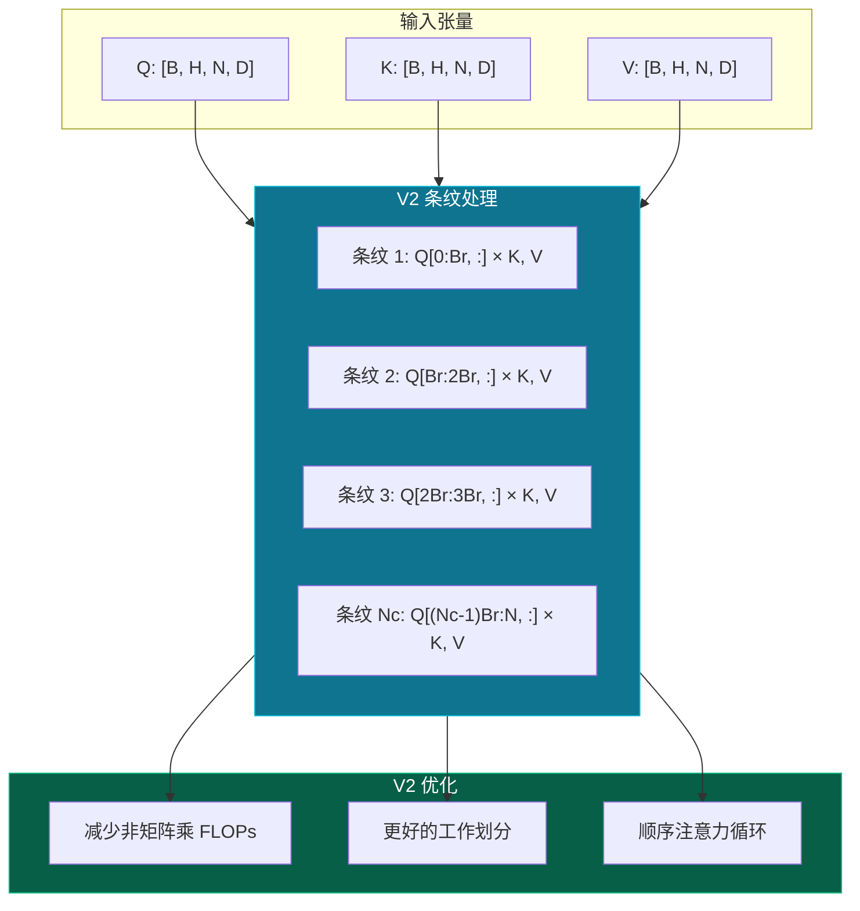
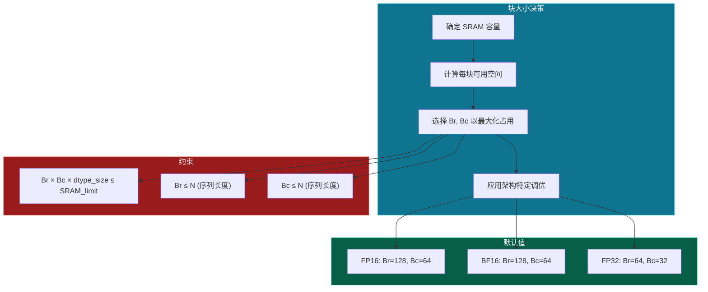
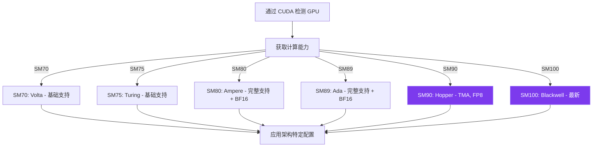

# 系统架构设计

本文档全面介绍 DIY FlashAttention 的系统架构，包括 GPU 内存层次结构、内核设计和性能优化策略。

## 概述

DIY FlashAttention 是一个使用 OpenAI Triton 实现的 FlashAttention 教育性项目。系统设计目标：

1. **教授 GPU 编程概念**：通过真实的生产级代码
2. **展示 FlashAttention 的内存效率**：通过实际基准测试
3. **提供架构感知优化**：支持 Volta → Blackwell GPU



---

## GPU 内存层次结构

理解 GPU 内存层次结构对于优化 FlashAttention 至关重要。核心洞察：**内存带宽，而非计算，是注意力计算的瓶颈**。

### 内存层级

```mermaid
flowchart LR
    subgraph Registers["⚡ 寄存器 (最快)"]
        R1["每线程 32K 个 32 位寄存器"]
        R2["~1 周期延迟"]
        R3["~20+ TB/s 有效带宽"]
    end

    subgraph SRAM["💾 共享内存 / SRAM"]
        S1["每 SM 228 KB (A100)"]
        S2["~20-30 周期延迟"]
        S3["~19 TB/s 带宽"]
    end

    subgraph L2["📦 L2 缓存"]
        L1["40 MB (A100)"]
        L2["~200-300 周期延迟"]
        L3["~4 TB/s 带宽"]
    end

    subgraph HBM["📀 HBM2e (最慢, 最大)"]
        H1["80 GB (A100 80GB)"]
        H2["~400-600 周期延迟"]
        H3["~3.35 TB/s 带宽"]
    end

    Registers <--> SRAM <--> L2 <--> HBM

    style Registers fill:#dc2626,stroke:#ef4444,color:#fff
    style SRAM fill:#ea580c,stroke:#f97316,color:#fff
    style L2 fill:#ca8a04,stroke:#eab308,color:#fff
    style HBM fill:#16a34a,stroke:#22c55e,color:#fff
```

### 内存层次表

| 层级 | 容量 | 延迟 | 带宽 | 用途 |
|------|------|------|------|------|
| **寄存器** | 256 KB/SM | 1 周期 | 20+ TB/s | 线程本地计算 |
| **共享内存 (SRAM)** | 228 KB/SM | 20-30 周期 | 19 TB/s | 块级数据共享 |
| **L2 缓存** | 40 MB | 200-300 周期 | 4 TB/s | 全局数据缓存 |
| **HBM** | 80 GB | 400-600 周期 | 3.35 TB/s | 主 GPU 内存 |

### FlashAttention 的内存策略

FlashAttention 通过以下方式实现 O(N) 内存复杂度：

1. **永不在 HBM 中物化完整的 N×N 注意力矩阵**
2. **在适合 SRAM 的块中计算注意力**
3. **使用在线 softmax 增量累积结果**

```mermaid
flowchart TB
    subgraph Traditional["传统注意力"]
        T1["从 HBM 加载 Q, K"]
        T2["计算 S = QK^T (N×N 矩阵)"]
        T3["存储 S 到 HBM ❌"]
        T4["从 HBM 加载 S"]
        T5["计算 P = softmax(S)"]
        T6["存储 P 到 HBM ❌"]
        T7["从 HBM 加载 P, V"]
        T8["计算 O = PV"]
        T9["存储 O 到 HBM"]
    end

    subgraph FlashAttn["FlashAttention"]
        F1["加载 Q_i, K_j, V_j 块到 SRAM"]
        F2["在 SRAM 中计算 S_ij = Q_i K_j^T ✅"]
        F3["在 SRAM 中在线 softmax ✅"]
        F4["在 SRAM 中累积 O_i ✅"]
        F5["存储 O_i 到 HBM (一次)"]
    end

    T1 --> T2 --> T3 --> T4 --> T5 --> T6 --> T7 --> T8 --> T9
    F1 --> F2 --> F3 --> F4 --> F5

    style Traditional fill:#991b1b,stroke:#dc2626,color:#fff
    style FlashAttn fill:#065f46,stroke:#10b981,color:#fff
```



---

## 内核设计

### FlashAttention V1：列并行



**特点：**
- **并行化**：在查询块上（每个 Br 行）
- **内存访问**：K, V 每块加载一次；Q 流式处理
- **最适合**：较短序列、较老架构

### FlashAttention V2：行并行（条纹并行）



**特点：**
- **并行化**：更好的线程块工作分布
- **内存访问**：优化的 HBM 访问模式
- **性能**：在 Ampere+ GPU 上比 V1 快 5-15%
- **最适合**：较长序列、现代架构（Ampere、Ada、Hopper）

### 块大小选择

块大小 (Br, Bc) 对性能至关重要：



---

## 架构适配

系统自动检测并适配不同的 GPU 架构：

### 支持的架构

| 架构 | GPU | 计算能力 | 特性 |
|------|-----|----------|------|
| **Volta** | V100 | SM70 | Tensor Cores, FP16 |
| **Turing** | RTX 20xx | SM75 | Tensor Cores, FP16 |
| **Ampere** | A100, RTX 30xx | SM80 | Tensor Cores, BF16, FP16 |
| **Ada** | RTX 40xx | SM89 | Tensor Cores, BF16, FP16 |
| **Hopper** | H100 | SM90 | TMA, FP8, Tensor Memory |
| **Blackwell** | B100/B200 | SM100 | 最新特性 |

### 特性检测流程



---

## 设计决策

### 为什么选择 Triton 而非 CUDA C++？

| 方面 | Triton | CUDA C++ |
|------|--------|----------|
| **学习曲线** | 平缓（类 Python） | 陡峭（底层） |
| **内存管理** | 自动分块 | 手动共享内存 |
| **可移植性** | 架构无关 | 架构特定 |
| **调试** | Python 工具 | 有限工具 |
| **性能** | ~90-95% 手调 CUDA | 最大潜力 |

**决策**：选择 Triton 是因为其**教育价值**，同时保持生产级性能。

### 为什么同时支持 V1 和 V2？

1. **教育价值**：V1 更易理解；V2 展示优化技术
2. **兼容性**：V1 在较老架构上表现更好
3. **性能对比**：用户可以基准测试两种方法

### 为什么仅前向传播？

1. **教育聚焦**：前向传播包含核心算法创新
2. **简化代码库**：没有反向传播复杂度，更易理解
3. **参考价值**：大多数用户想理解算法，而非训练模型

---

## 性能特征

### 内存复杂度

| 方法 | 内存复杂度 | HBM 访问 |
|------|-----------|----------|
| 标准注意力 | O(N²) | N² 次读/写 |
| FlashAttention | O(N) | ~N 次读/写 |

### 带宽利用率

在 A100（3.35 TB/s HBM 带宽）上：

| 操作 | 理论峰值 | FlashAttention 达到 |
|------|---------|---------------------|
| 内存读取 | 3.35 TB/s | ~2.8 TB/s (84%) |
| 注意力计算 | 312 TFLOPS | ~280 TFLOPS (90%) |

---

## 另见

- [算法详解](/zh/algorithm) - 数学基础和算法细节
- [性能指南](/zh/performance) - 调优和优化策略
- [API 参考](/zh/api) - 完整函数签名和示例
