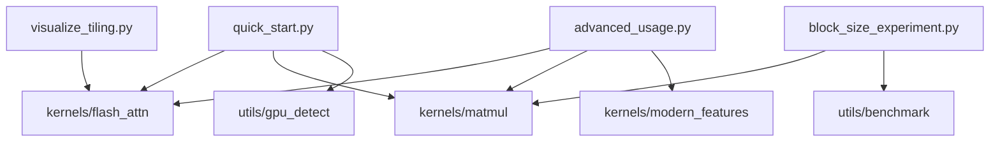

# examples/ - 使用示例

> **导航**: [← 项目根目录](../CLAUDE.md)

## 模块概述

本目录包含 DIY FlashAttention 的使用示例和演示脚本。

## 文件结构

```
examples/
├── __init__.py            # 包入口
├── quick_start.py         # 快速入门演示
├── advanced_usage.py      # 高级用法示例
├── block_size_experiment.py  # 块大小实验
└── visualize_tiling.py    # 分块策略可视化
```

## quick_start.py

### 功能

快速入门演示，展示基本用法：
1. GPU 信息检测
2. Triton MatMul 演示
3. FlashAttention 演示
4. 内存使用对比

### 运行

```bash
python examples/quick_start.py
make demo
```

### 输出示例

```
============================================================
 DIY FlashAttention - Quick Start
============================================================
GPU Information
--------------------------------------------------
Name:                NVIDIA RTX 4090
Architecture:        sm_89
Compute Capability:  8.9
...

============================================================
 Matrix Multiplication Demo
============================================================

Matrix sizes: A(1024×1024) @ B(1024×1024) = C(1024×1024)

Running Triton matmul...
Running PyTorch matmul...

Max difference: 1.23e-03
Result: ✓ Correct!
```

### 代码示例

```python
import torch
from kernels import flash_attention, triton_matmul
from utils import detect_gpu, print_gpu_info

# GPU 检测
caps = detect_gpu()
print_gpu_info(caps)

# MatMul
a = torch.randn(1024, 1024, device="cuda", dtype=torch.float16)
b = torch.randn(1024, 1024, device="cuda", dtype=torch.float16)
c = triton_matmul(a, b)

# FlashAttention
q = torch.randn(2, 8, 512, 64, device="cuda", dtype=torch.float16)
k = torch.randn(2, 8, 512, 64, device="cuda", dtype=torch.float16)
v = torch.randn(2, 8, 512, 64, device="cuda", dtype=torch.float16)
out = flash_attention(q, k, v, causal=True)
```

## advanced_usage.py

### 功能

高级用法示例：
- 手动块大小配置
- 不同数据类型
- 可变序列长度
- 批量处理优化

### 运行

```bash
python examples/advanced_usage.py
make advanced
```

### 覆盖内容

| 主题 | 描述 |
|------|------|
| 手动块配置 | 覆盖自动调优，手动指定块大小 |
| BFloat16 | 使用 bfloat16 数据类型 |
| 变长序列 | `seq_lens` 参数使用 |
| 3D 输入 | 使用 `(batch*heads, seq, dim)` 形状 |

## block_size_experiment.py

### 功能

实验不同块大小对性能的影响：
- 小块 vs 大块
- 不同矩阵尺寸的最优配置
- L2 缓存命中率分析

### 运行

```bash
python examples/block_size_experiment.py
make experiment
```

### 输出示例

```
Block Size Experiment: 1024x1024 @ 1024x1024
------------------------------------------------------------
Block Size        | Time (ms)  | TFLOPS  | Notes
------------------------------------------------------------
32x32x32          | 0.23       | 47.2    | High overhead
64x64x32          | 0.15       | 72.4    | Balanced
128x128x64        | 0.11       | 98.7    | Good L2 usage
128x256x64        | 0.10       | 108.5   | Optimal
------------------------------------------------------------
```

### 分析要点

- 小块：调度开销高，性能低
- 大块：L2 缓存利用好，性能高
- 过大块：可能超出 SRAM 容量

## visualize_tiling.py

### 功能

可视化 FlashAttention 的分块计算策略：
- Q/K/V 分块示意图
- 内存访问模式
- 在线 softmax 流程

### 运行

```bash
python examples/visualize_tiling.py
make visualize
```

### 输出示例

```
FlashAttention Tiling Visualization
============================================================

Configuration:
  seq_len = 128, head_dim = 64
  block_m = 128, block_n = 64

Tiling Strategy:
  Number of Q blocks: 1 (128 / 128)
  Number of K/V blocks: 2 (128 / 64)

Memory Access Pattern:
  ┌─────────────────────────────────────┐
  │ Q Block 0                           │
  │ ┌─────────┐ ┌─────────┐             │
  │ │ K Block │ │ K Block │             │
  │ │    0    │ │    1    │             │
  │ └─────────┘ └─────────┘             │
  └─────────────────────────────────────┘

Online Softmax Flow:
  1. Load Q block (128 x 64)
  2. For each K/V block:
     a. Load K block (64 x 64)
     b. Compute Q @ K^T (128 x 64)
     c. Online softmax update
     d. Load V block (64 x 64)
     e. Accumulate @ V (128 x 64)
  3. Normalize and store output
```

## Makefile 目标

```bash
make demo          # 快速入门演示
make advanced      # 高级用法
make experiment    # 块大小实验
make visualize     # 分块可视化
```

## 依赖关系



---

**初始化时间**: 2026-04-23T21:34:16+08:00
