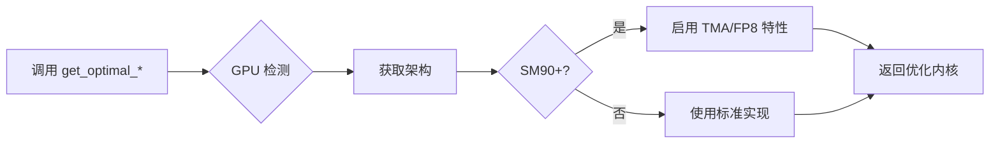
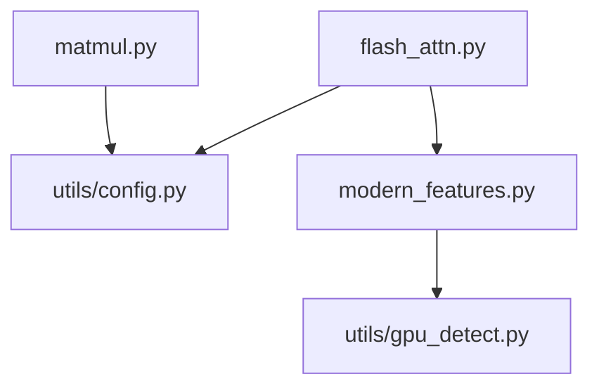

# kernels/ - Triton GPU 内核

> **导航**: [← 项目根目录](../CLAUDE.md)

## 模块概述

本目录包含 DIY FlashAttention 项目的核心 Triton GPU 内核实现。

## 文件结构

```
kernels/
├── __init__.py          # 包入口，统一导出
├── flash_attn.py        # FlashAttention 前向传播内核
├── matmul.py            # 高性能矩阵乘法内核
├── modern_features.py   # Hopper+ 特性检测与自适应选择
└── py.typed             # PEP 561 类型标记
```

## 公开 API

### 主要函数

| 函数 | 签名 | 描述 |
|------|------|------|
| `flash_attention` | `(q, k, v, causal=False, sm_scale=None, seq_lens=None) -> Tensor` | FlashAttention 前向计算 |
| `triton_matmul` | `(a, b, block_m=None, block_n=None, block_k=None, use_autotune=True) -> Tensor` | Triton 矩阵乘法 |
| `get_optimal_matmul` | `() -> Callable` | 获取当前 GPU 最优 matmul 实现 |
| `get_optimal_attention` | `() -> Callable` | 获取当前 GPU 最优 attention 实现 |

### 辅助函数

| 函数 | 描述 |
|------|------|
| `check_hopper_features()` | 检测 Hopper+ GPU 特性 |
| `supports_fp8()` | 检查 FP8 支持 |
| `get_matmul_config()` | 获取最优 matmul 配置 |
| `get_attention_config()` | 获取最优 attention 配置 |

### 类

| 类 | 描述 |
|------|------|
| `AdaptiveKernelSelector` | 基于架构的自适应内核选择器 |

## flash_attn.py 详解

### 核心算法

1. **在线 Softmax (Online Softmax)**
   - 增量计算 softmax，避免物化完整注意力矩阵
   - 内存复杂度从 O(N²) 降为 O(N)

2. **分块计算 (Tiled Computation)**
   - Q, K, V 分块加载到 SRAM
   - 最小化 HBM 访问

3. **因果掩码 (Causal Masking)**
   - 支持 GPT 风格的自回归模型

### 输入支持

| 形状 | 支持 |
|------|------|
| 3D: `(batch*heads, seq_len, head_dim)` | ✅ |
| 4D: `(batch, heads, seq_len, head_dim)` | ✅ |

### 数据类型

| dtype | 支持 |
|-------|------|
| float16 | ✅ |
| bfloat16 | ✅ |
| float32 | ✅ (内部转 float16) |

### 约束

- `head_dim` 必须是 32 或 64
- 所有张量必须在同一 CUDA 设备上
- 需要 Triton 2.1+

## matmul.py 详解

### 自动调优配置

```python
configs = [
    {"BLOCK_SIZE_M": 128, "BLOCK_SIZE_N": 256, "BLOCK_SIZE_K": 64, "GROUP_SIZE_M": 8},
    {"BLOCK_SIZE_M": 64,  "BLOCK_SIZE_N": 256, "BLOCK_SIZE_K": 32, "GROUP_SIZE_M": 8},
    {"BLOCK_SIZE_M": 128, "BLOCK_SIZE_N": 128, "BLOCK_SIZE_K": 32, "GROUP_SIZE_M": 8},
    # ... 更多配置
]
```

### L2 缓存优化

使用 super-grouping 技术提高 L2 缓存命中率。

### 手动块大小

可覆盖自动调优，手动指定块大小用于实验。

## modern_features.py 详解

### Hopper+ 特性

| 特性 | 描述 | 最低架构 |
|------|------|----------|
| TMA | Tensor Memory Accelerator | SM90 |
| FP8 | 8-bit 浮点 | SM90 |
| Warpgroup MMA | 矩阵乘法加速 | SM90 |

### FP8 转换

```python
from kernels import to_fp8_e4m3, to_fp8_e5m2

# E4M3: 适合权重和激活
fp8_tensor = to_fp8_e4m3(tensor)

# E5M2: 适合梯度
fp8_tensor = to_fp8_e5m2(tensor)
```

### 自适应选择流程



## 依赖关系



## 测试覆盖

- `tests/test_flash.py` - FlashAttention 单元测试
- `tests/test_matmul.py` - MatMul 单元测试
- `tests/test_modern_features.py` - 特性检测测试
- `tests/test_properties.py` - Hypothesis 属性测试

## 性能基准

见 `benchmarks/bench_flash.py` 和 `benchmarks/bench_matmul.py`

---

**初始化时间**: 2026-04-23T21:34:16+08:00
