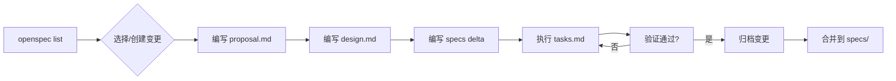

# openspec/ - 规范管理

> **导航**: [← 项目根目录](../CLAUDE.md)

## 模块概述

本目录包含 DIY FlashAttention 项目的 OpenSpec 规范文件，定义项目的capability specs和active changes。

## 文件结构

```
openspec/
├── config.json                 # OpenSpec 配置
├── specs/                      # 能力规范 (归档状态)
│   ├── README.md               # 规范说明
│   ├── flashattention-kernels/ # 内核行为规范
│   ├── project-surface/        # README/Pages 规范
│   ├── engineering-workflow/   # CI/质量工具规范
│   └── project-governance/     # OpenSpec 工作流规范
├── changes/                    # 活跃变更
│   └── stabilize-project-for-archive/
│       ├── .openspec.yaml      # 变更元数据
│       ├── proposal.md         # 变更提案
│       ├── design.md           # 设计文档
│       ├── tasks.md            # 任务清单
│       └── specs/              # 变更 delta specs
├── templates/                  # 变更模板
│   ├── feature.md
│   ├── bugfix.md
│   └── rfc.md
└── changes/archive/            # 已完成变更归档
```

## 能力规范 (specs/)

### flashattention-kernels

**文件**: `specs/flashattention-kernels/spec.md`

**覆盖范围**:
- Triton MatMul 内核行为
- FlashAttention 前向传播行为
- 架构自适应逻辑
- 基准测试和正确性验证

**关键场景**:
- Valid CUDA matmul inputs
- Manual block sizes override autotune
- Standard attention invocation
- Causal masking
- Variable per-batch sequence lengths
- Modern feature detection
- Fallback on unsupported hardware

### project-surface

**文件**: `specs/project-surface/spec.md`

**覆盖范围**:
- README 内容规范
- GitHub Pages 内容规范
- GitHub 仓库元数据

**关键要求**:
- README 和 Pages 讲述同一个故事
- 明确教育性、前向传播定位
- GitHub About 与 README 一致

### engineering-workflow

**文件**: `specs/engineering-workflow/spec.md`

**覆盖范围**:
- CI/CD 配置
- Git hooks
- 编辑器/LSP 配置
- AI 工具协调

**关键要求**:
- 质量门槛保持高信号
- Hook 安装轻量级
- AI 工具指导明确

### project-governance

**文件**: `specs/project-governance/spec.md`

**覆盖范围**:
- OpenSpec 工作流
- 审查纪律
- 归档就绪范围管理

## 活跃变更 (changes/)

### stabilize-project-for-archive

**状态**: 活跃

**目的**: 项目归档前的稳定化

**文件**:
| 文件 | 用途 |
|------|------|
| `proposal.md` | 变更动机和范围 |
| `design.md` | 实现设计 |
| `tasks.md` | 执行任务清单 |
| `specs/` | 对各能力的 delta 修改 |

## 模板 (templates/)

| 模板 | 用途 |
|------|------|
| `feature.md` | 新功能提案模板 |
| `bugfix.md` | 错误修复模板 |
| `rfc.md` | 征求意见模板 |

## OpenSpec 工作流



## CLI 命令

```bash
# 列出变更
openspec list --json

# 验证规范
openspec validate --specs --json

# 验证特定变更
openspec validate stabilize-project-for-archive --json

# 应用变更指令
openspec instructions apply --change stabilize-project-for-archive --json

# 查看变更状态
openspec status --change stabilize-project-for-archive --json
```

## Makefile 目标

```bash
make validate-openspec  # 验证所有规范和活跃变更
```

## 规范格式

每个 `spec.md` 遵循以下结构：

```markdown
## Purpose

[一句话描述能力范围]

## Requirements

### Requirement: [需求名称]
[需求描述]

#### Scenario: [场景名称]
- **WHEN** [触发条件]
- **THEN** [预期结果]
```

## 与代码的关系

| 规范 | 对应代码 |
|------|----------|
| flashattention-kernels | `kernels/`, `benchmarks/`, `utils/validation.py` |
| project-surface | `README.md`, `docs/`, GitHub 元数据 |
| engineering-workflow | `.github/workflows/`, `Makefile`, `pyproject.toml` |
| project-governance | OpenSpec 工作流实践 |

## CI 集成

在 `.github/workflows/ci.yml` 中自动验证：

```yaml
openspec-validate:
  steps:
    - name: Validate OpenSpec specs and active changes
      run: |
        openspec validate --specs --json
        # 验证所有活跃变更
        for change in $(openspec list --json | jq -r '.changes[].id'); do
          openspec validate "$change" --json
        done
```

---

**初始化时间**: 2026-04-23T21:34:16+08:00
