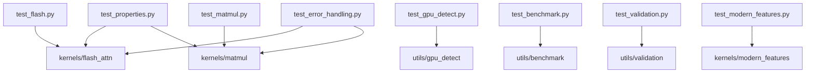

# tests/ - 测试套件

> **导航**: [← 项目根目录](../CLAUDE.md)

## 模块概述

本目录包含 DIY FlashAttention 项目的完整测试套件，覆盖单元测试、属性测试和边界测试。

## 文件结构

```
tests/
├── __init__.py              # 包入口
├── conftest.py              # Pytest 配置与 fixtures
├── test_flash.py            # FlashAttention 单元测试
├── test_matmul.py           # MatMul 单元测试
├── test_modern_features.py  # Hopper+ 特性测试
├── test_gpu_detect.py       # GPU 检测测试
├── test_benchmark.py        # 基准工具测试
├── test_validation.py       # 验证工具测试
├── test_error_handling.py   # 错误处理测试
└── test_properties.py       # Hypothesis 属性测试
```

## Pytest 配置

### Markers

| Marker | 用途 |
|--------|------|
| `@pytest.mark.cuda` | 需要 CUDA GPU |
| `@pytest.mark.slow` | 长时间运行测试 |

### Fixtures (conftest.py)

| Fixture | Scope | 描述 |
|---------|-------|------|
| `cuda_available` | session | 检查 CUDA 可用性 |
| `device` | session | 获取 CUDA 设备 |
| `random_seed` | function | 设置随机种子 |
| `small_matrices` | function | 64×64 测试矩阵 |
| `medium_matrices` | function | 512×512 测试矩阵 |
| `attention_tensors` | function | Attention 测试张量 |

### 使用示例

```python
import pytest

@pytest.mark.cuda
def test_with_cuda(device):
    # 仅在有 GPU 时运行
    x = torch.randn(100, device=device)
    ...

def test_cpu_only():
    # CPU-safe 测试
    ...
```

## 测试分类

### test_flash.py - FlashAttention 测试

| 测试 | 描述 |
|------|------|
| `test_flash_attention_correctness` | 基本正确性 |
| `test_flash_attention_causal` | 因果掩码 |
| `test_flash_attention_3d_input` | 3D 输入支持 |
| `test_flash_attention_4d_input` | 4D 输入支持 |
| `test_flash_attention_different_dtypes` | 多数据类型 |
| `test_flash_attention_variable_seq_len` | 可变序列长度 |

### test_matmul.py - MatMul 测试

| 测试 | 描述 |
|------|------|
| `test_matmul_correctness` | 基本正确性 |
| `test_matmul_autotune` | 自动调优 |
| `test_matmul_manual_blocks` | 手动块大小 |
| `test_matmul_non_power_of_2` | 非二次幂维度 |
| `test_matmul_different_dtypes` | 多数据类型 |

### test_properties.py - 属性测试

使用 Hypothesis 进行属性测试：

```python
from hypothesis import given, strategies as st

@given(
    m=st.integers(min_value=16, max_value=512),
    n=st.integers(min_value=16, max_value=512),
    k=st.integers(min_value=16, max_value=512),
)
def test_matmul_properties(m, n, k):
    # 无限输入空间验证
    ...
```

**属性覆盖**:
- MatMul 结合律
- Attention 输出形状
- 数值稳定性

### test_error_handling.py - 错误处理测试

| 测试 | 描述 |
|------|------|
| `test_unsupported_dtype` | 不支持的数据类型 |
| `test_mismatched_shapes` | 形状不匹配 |
| `test_non_cuda_tensor` | 非 CUDA 张量 |
| `test_block_size_exceeds_dimension` | 块大小越界 |
| `test_invalid_head_dim` | 无效 head_dim |

### test_gpu_detect.py - GPU 检测测试

| 测试 | 描述 |
|------|------|
| `test_detect_gpu_returns_capabilities` | 返回正确结构 |
| `test_gpu_arch_detection` | 架构识别 |
| `test_get_optimal_config` | 最优配置 |

### test_benchmark.py - 基准工具测试

| 测试 | 描述 |
|------|------|
| `test_benchmark_result_str` | 结果字符串化 |
| `test_calculate_flops` | FLOPs 计算 |

### test_validation.py - 验证工具测试

| 测试 | 描述 |
|------|------|
| `test_validate_matmul` | MatMul 验证 |
| `test_validate_attention` | Attention 验证 |
| `test_edge_case_validation` | 边界验证 |

### test_modern_features.py - Hopper+ 特性测试

| 测试 | 描述 |
|------|------|
| `test_check_hopper_features` | 特性检测 |
| `test_supports_fp8` | FP8 支持 |
| `test_adaptive_kernel_selector` | 自适应选择 |

## 运行命令

```bash
# CPU-safe 测试 (无需 GPU)
make test-cpu
pytest tests/ -v -m "not cuda"

# 完整 GPU 测试套件
make test-gpu
pytest tests/ -v

# 仅属性测试
pytest tests/test_properties.py -v

# 覆盖率报告
pytest tests/ --cov=kernels --cov=utils --cov-report=html
```

## 覆盖率目标

| 模块 | 目标覆盖率 |
|------|-----------|
| `kernels/` | ≥ 85% |
| `utils/` | ≥ 90% |

当前配置: `pyproject.toml` 中 `fail_under = 75`

## 依赖关系



---

**初始化时间**: 2026-04-23T21:34:16+08:00
