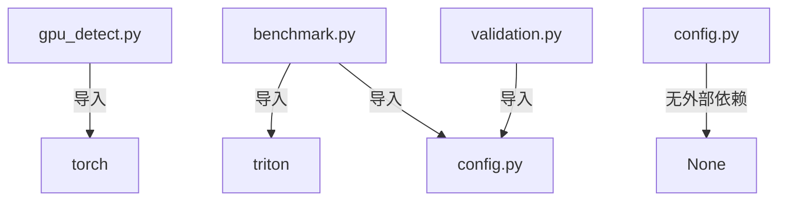

# utils/ - 工具函数

> **导航**: [← 项目根目录](../CLAUDE.md)

## 模块概述

本目录包含 GPU 检测、基准测试、验证和配置管理等工具函数。

## 文件结构

```
utils/
├── __init__.py       # 包入口
├── config.py         # 配置常量
├── gpu_detect.py     # GPU 架构检测
├── benchmark.py      # 基准测试工具
├── validation.py     # 正确性验证
└── py.typed          # PEP 561 类型标记
```

## 公开 API

### gpu_detect.py

| 导出 | 类型 | 描述 |
|------|------|------|
| `GPUArch` | Enum | GPU 架构枚举 (Volta → Blackwell) |
| `GPUCapabilities` | Dataclass | GPU 能力信息 |
| `detect_gpu()` | Function | 检测当前 GPU |
| `get_optimal_config()` | Function | 获取最优内核配置 |
| `print_gpu_info()` | Function | 打印 GPU 信息 |

### benchmark.py

| 导出 | 类型 | 描述 |
|------|------|------|
| `BenchmarkResult` | Dataclass | 基准测试结果 |
| `BenchmarkRunner` | Class | 基准测试运行器 |
| `benchmark_fn()` | Function | 单函数计时 |
| `calculate_matmul_flops()` | Function | MatMul FLOPs 计算 |
| `calculate_attention_flops()` | Function | Attention FLOPs 计算 |

### validation.py

| 导出 | 类型 | 描述 |
|------|------|------|
| `validate_matmul()` | Function | MatMul 正确性验证 |
| `validate_attention()` | Function | Attention 正确性验证 |
| `validate_matmul_edge_cases()` | Function | MatMul 边界测试 |
| `validate_attention_edge_cases()` | Function | Attention 边界测试 |

### config.py

| 常量 | 值 | 描述 |
|------|------|------|
| `MATMUL_GROUP_SIZE_M` | 8 | L2 缓存优化组大小 |
| `MATMUL_DEFAULT_BLOCK_*` | 128/256/64 | 默认块大小 |
| `FLASH_ATTN_DEFAULT_BLOCK_*` | 128/64 | 默认块大小 |
| `BENCHMARK_WARMUP` | 25 | 预热迭代次数 |
| `BENCHMARK_REPETITIONS` | 100 | 计时迭代次数 |
| `DEFAULT_RTOL` | 1e-3 | 相对容差 |
| `DEFAULT_ATOL` | 1e-3 | 绝对容差 |

## GPU 架构检测

### GPUArch 枚举

```python
class GPUArch(Enum):
    VOLTA = "sm_70"      # V100
    TURING = "sm_75"     # RTX 20xx
    AMPERE = "sm_80"     # A100, RTX 30xx
    ADA = "sm_89"        # RTX 40xx
    HOPPER = "sm_90"     # H100
    BLACKWELL = "sm_100" # B100/B200
    UNKNOWN = "unknown"
```

### GPUCapabilities 字段

| 字段 | 类型 | 描述 |
|------|------|------|
| `name` | str | GPU 名称 |
| `arch` | GPUArch | 架构枚举 |
| `compute_capability` | tuple[int, int] | 计算能力 |
| `has_tma` | bool | TMA 支持 |
| `has_fp8` | bool | FP8 支持 |
| `has_warpgroup_mma` | bool | Warpgroup MMA 支持 |
| `sram_per_sm` | int | 每 SM 共享内存 (字节) |
| `num_sms` | int | SM 数量 |
| `total_memory_gb` | float | 总显存 (GB) |

### 使用示例

```python
from utils import detect_gpu, print_gpu_info, get_optimal_config

caps = detect_gpu()
print_gpu_info(caps)

config = get_optimal_config(caps, "flash_attention")
print(config["BLOCK_M"])  # 128 for Hopper+
```

## 基准测试工具

### BenchmarkRunner

```python
from utils.benchmark import BenchmarkRunner
from kernels import flash_attention

runner = BenchmarkRunner(warmup=25, rep=100)

# 测试 Attention
results = runner.benchmark_attention(
    flash_fn=flash_attention,
    seq_lengths=[128, 256, 512, 1024],
    batch_size=4,
    num_heads=8,
    head_dim=64,
    causal=False,
)

# 打印对比表
runner.print_comparison_table(results)
```

### BenchmarkResult 字段

| 字段 | 类型 | 描述 |
|------|------|------|
| `name` | str | 实现名称 |
| `size` | tuple | 张量尺寸 |
| `time_ms` | float | 执行时间 (ms) |
| `tflops` | float | 吞吐量 (TFLOPS) |
| `memory_mb` | float | 内存使用 (MB) |
| `block_config` | dict | 块配置 (可选) |

## 验证工具

### 使用示例

```python
from utils.validation import validate_matmul, validate_attention
from kernels import triton_matmul, flash_attention

# MatMul 验证
is_valid, max_diff = validate_matmul(
    triton_matmul, M=512, N=512, K=512, verbose=True
)

# Attention 验证
is_valid, max_diff = validate_attention(
    flash_attention, batch=2, heads=8, seq_len=128, head_dim=64, causal=True
)

# 边界测试
validate_matmul_edge_cases(triton_matmul)
validate_attention_edge_cases(flash_attention)
```

## 依赖关系



## 测试覆盖

- `tests/test_gpu_detect.py` - GPU 检测测试
- `tests/test_benchmark.py` - 基准测试工具测试
- `tests/test_validation.py` - 验证工具测试

---

**初始化时间**: 2026-04-23T21:34:16+08:00
